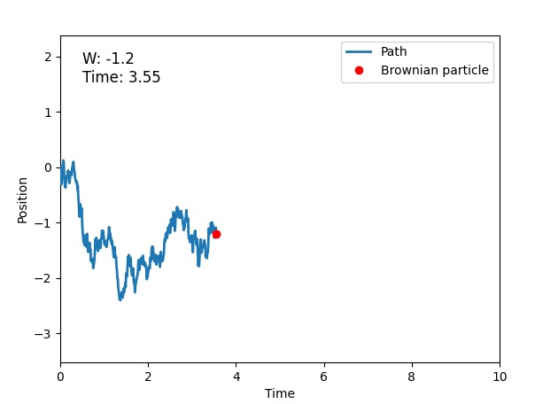
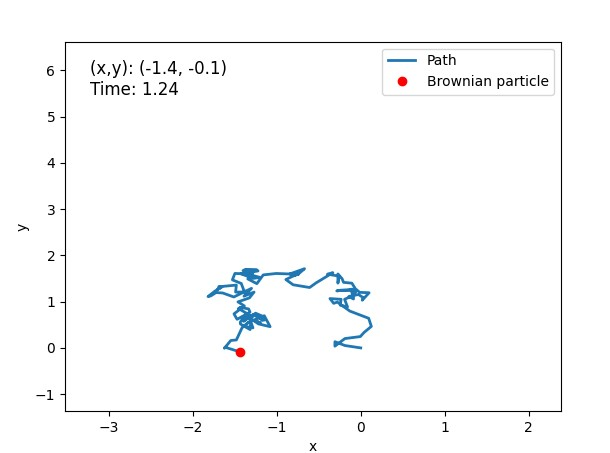

# Brownian Motion
## 1D Brownian Motion

<figure>
  
</figure>

Here we plot a particle's "W" value over time.

## 2D Brownian Motion

<figure>
  
</figure>

Here we show the 2D position of the particle over time. 

## 3D Brownian Motion

<figure>
  
</figure>

Here we show the 3D position of the particle over time. 
